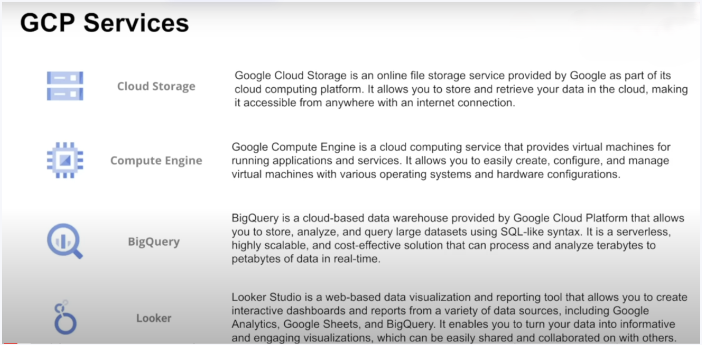
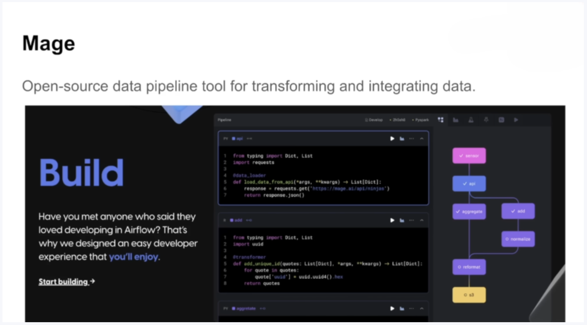
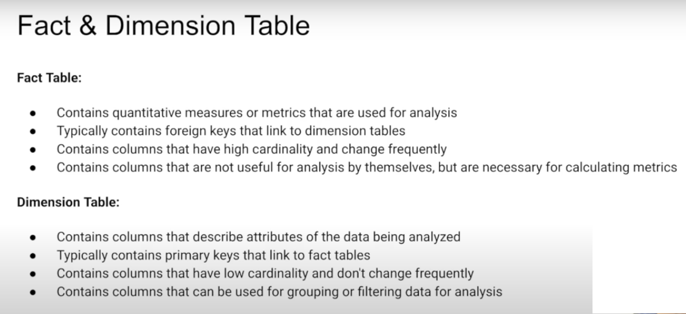

# Uber Data Analytics | Modern Data Engineering GCP Project

## Introduction

The goal of this project is to perform data analytics on Uber data using various tools and technologies, including GCP Storage, Python, Compute Instance, Mage Data Pipeline Tool, BigQuery, and Looker Studio.

 
 

 
 
 

 
 
 

## Architecture 

## Technology Used
- Programming Language - Python

Google Cloud Platform
1. Google Storage
2. Compute Instance 
3. BigQuery
4. Looker Studio

Modern Data Pipeine Tool - https://www.mage.ai/

## Dataset Used
TLC Trip Record Data
Yellow and green taxi trip records include fields capturing pick-up and drop-off dates/times, pick-up and drop-off locations, trip distances, itemized fares, rate types, payment types, and driver-reported passenger counts. 

Here is the dataset used in the video - https://github.com/visheshgupta-BA/Uber-Data-Engineering-Project/blob/main/Data/uber_data.csv

More info about dataset can be found here:
1. Website - https://www.nyc.gov/site/tlc/about/tlc-trip-record-data.page
2. Data Dictionary - https://www.nyc.gov/assets/tlc/downloads/pdf/data_dictionary_trip_records_yellow.pdf

## Data Model

